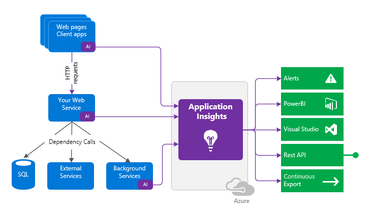

¿Alguna vez has intentado crear una aplicación con múltiples servicios y múltiples componentes, crear una solución de registro de eventos (loggin) adecuada
puede ser un gran desafío, pero este desafío podría ser más fácil si se usa la herramienta adecuada y la herramienta adecuada para el trabajo es [Application Insights](https://docs.microsoft.com/es-es/azure/azure-monitor/app/app-insights-overview).

# Application Insight

## Concepto
Es un servicio que ofrece la nube de **Microsoft (Azure)**, donde se tiene total observabilidad en la aplicación donde se puede hacer lo siguiente:

1. Supervisión de la disponibilidad y el rendimiento.
2. Diagnóstico de código profundo con profiler y debugger. 
3. Usuarios e información de uso.
4. Clasificación de fallas y rendimiento.
5. Integración con Microsoft Azure y Visual Studio.
 
Además, también ofrece la posibilidad de insertar trazas personalizadas y registrar errores de aplicaciones, servicios o componentes.

También ofrece la posibilidad de configurar alertas personalizadas, en las que, por ejemplo, podemos recibir un **email** cada vez que se produzca un determinado error.

## Ventajas
1. **Uso en múltiples plataformas**: Application Insights es un SDK disponible para tecnologias de Net Core, python, Servicios de Azure, Servidores J2EE, Páginas web, NodeJS ([ver Idiomas compatibles](https://docs.microsoft.com/es-es/azure/azure-monitor/app/platforms)).

2. **Consulta de multitud de datos y registros de seguimiento**: Analizar datos esta bastante sencilla gracias al lenguaje de consulta Kusto query language (KQL).

## Como funciona
Para el funcionamiento de la herramienta solo basta con la instalar una pequeña libreria (SDK) en la aplicación y habilitar el servicio en Azure creando una clave de instrumentación única. 

El impacto al usar esta libreria es **minima**, las invocaciones no bloquean la aplicación y se agrupan por lotes y los componentes no necesariamente deben estar hospedados en la nube de azure.

App Insights supervisa las operaciones de varias aplicaciones y productos que se puedan tener, independientemente de si se trata de una API, una aplicación MVC, un procesador de datos en segundo plano, una aplicación front-end o una aplicación móvil, etc.

## Que supervisa
Application Insights ayuda a comprender el rendimiento y el uso de las aplicaciones. Application Insights supervisa lo siguiente:

* **Tasas de solicitudes (Requests rates), tiempos de respuesta (Response times) y tasas de error (Failure rates)**:  Encontrar qué páginas son las más populares, en qué momento del día y dónde están los usuarios.Que paginas presentan bajos rendimientos.Tiempos de respuesta y tasas de errores.
* **Excepciones (Exceptions)**
* **Llamadas ajax** desde paginas web, tiempos de respuestas y tasas de error.
* **Número de usuarios y sesiones**
* **Tasas de dependencia** Verificar que servicios externos ralentizan el sistema.
* **Contadores de rendimiento** de servidores windows o linux, para verificar CPU, memoria y uso de la red.

## Que supervisa

https://www.youtube.com/watch?v=A0jAeGf2zUQ